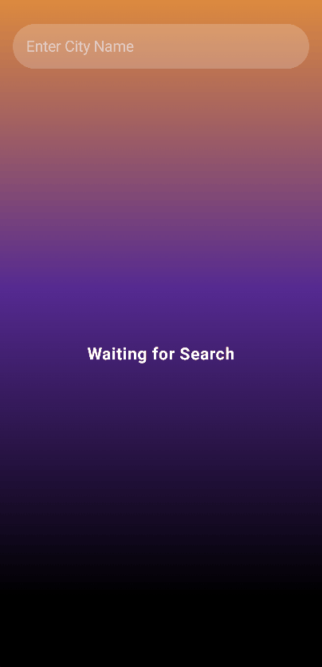

  <h1>My Finances</h1>


  

 

  <h4>
    
  </h4>


</div>
<br/>

<h1>
  Project 💻
</h1>
<p>
 
A simpple weather application using Jetpack Compose, Retrofit and Open Weather API. I made this app with the aim of learn more about Retrofit and HTTP Requests
</p>

<br/>

<div>
<h1>
  Technologies 🚀 
</h1>
  
- Kotlin
- Jetpack Compose
- Android Studio

</div>

<br/>

<h1>
  How to Test It 🤳🏽
</h1>
To test this project you only need to clone this repository with 
<br/>
<br/>

```
git clone https://github.com/lucasmsaluno/weather-app
```

<br/>
and open it in your android studio :)
OBS: Emulator Used -> Pixel 4a with Android API 33
